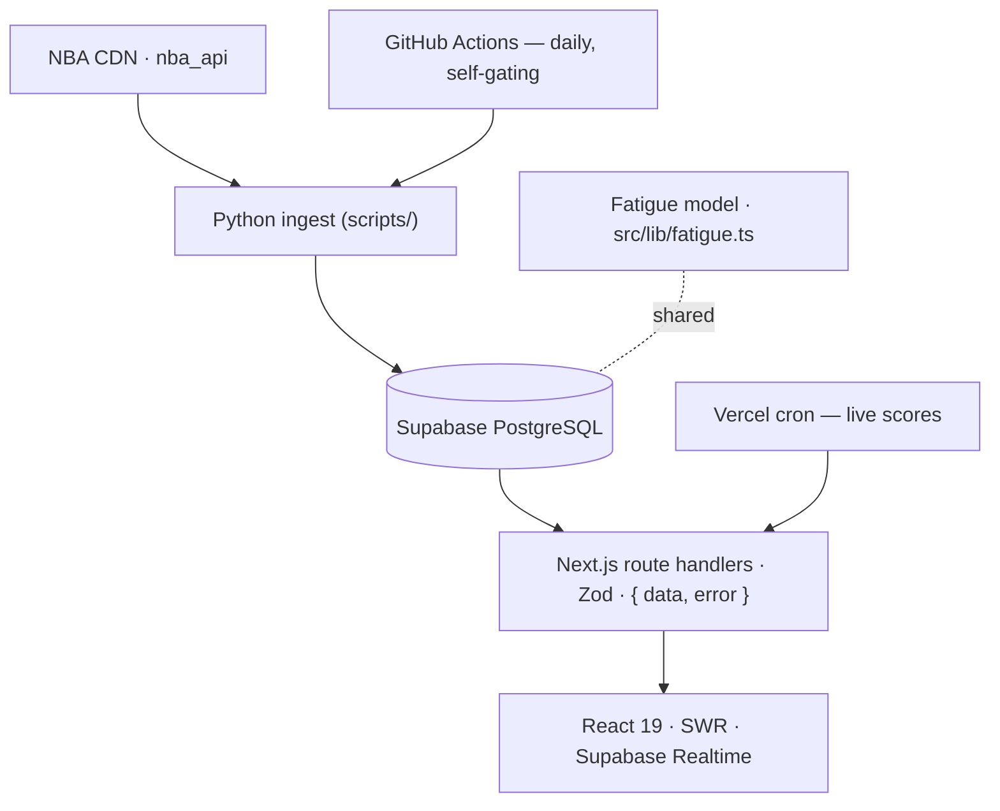

# 🏀 FullCourt

**An NBA analytics platform that turns four decades of schedule data into game-level predictions.**

[](https://github.com/mhju0/fullcourt/actions/workflows/daily-update.yml)


FullCourt quantifies how **travel, rest, and schedule density** shape NBA outcomes. Its flagship model assigns every team a multi-factor **fatigue score**, derives a **rest advantage** for each matchup, and backtests it against roughly 40 seasons of regular-season results.

> **The finding:** the more-rested team wins the majority of games — and the edge widens once the rest-advantage gap reaches **5+ points**. The headline rates are computed live from the DB and surfaced on the site (currently **~54.8%** overall, rising to **~61.1%** at a gap of 5+).

🔗 **Live demo:** https://fullcourt-nba.vercel.app &nbsp;·&nbsp; **Code:** https://github.com/mhju0/fullcourt

<!-- Add a screenshot or short GIF of the app here — it's one of the highest-impact things on a portfolio README:

-->

---

## Features

- **Today's Games** — live matchup cards with fatigue bars, a rest-advantage gauge, and real-time score/status updates via Supabase Realtime.
- **Analysis** — a historical backtest: win rate by rest-advantage threshold and by season, home/away splits, and a filterable game explorer.
- **Picks** — upcoming regular-season games ranked by their predicted rest-advantage edge.
- **Playoff Predictor** — series-winner predictions from rest/fatigue-derived features, with walk-forward-OOS vs. in-sample accuracy shown side by side.
- **Shot Quality (Expected Shot Value / xeFG%)** — a half-court hexbin map of expected effective FG% per grid cell, comparing a location-only gradient-boosted model against a zone-average baseline. Honest framing: no defender distance or shot-clock data exists in public NBA data, so this is shot-location value only, and the model's edge over the baseline is a small calibration win (~1% on log-loss/Brier), not a big accuracy jump.

The platform is built to grow module by module — see [docs/ROADMAP.md](docs/ROADMAP.md) for what's next.

---

## Architecture



- **Ingest (Python):** `nba_api` and the NBA CDN feed schedules, scores, and overtime data into Postgres. A daily GitHub Actions job **self-gates by reading the live league schedule**, so it runs only during the regular season and exits cleanly in the offseason — no hardcoded dates.
- **Model (TypeScript):** a single source-of-truth fatigue engine (`src/lib/fatigue.ts`) is shared by every pipeline writer *and* every API read, so the math is never duplicated.
- **Store:** Supabase PostgreSQL with Row-Level Security; reads run as type-safe Drizzle queries.
- **Serve:** Next.js App Router route handlers (Zod-validated, `{ data, error }` envelope) feed a React 19 frontend using SWR and Supabase Realtime.
- **Ship:** Vercel auto-deploys from `main`; GitHub Actions runs the daily pipeline.

The diagram above is the flagship rest-advantage flow. Playoff Predictor and Shot Quality are
**additive, isolated modules** — separate scripts/tables/routes/pages that never touch
`fatigue.ts` and are never read by the flagship queries; see [docs/ARCHITECTURE.md](docs/ARCHITECTURE.md)
for their data flows.

---

## The fatigue model

Each team's score combines:

- **Workload** — exponential decay over the last 30 days (recent games weigh more).
- **Travel** — log-scaled great-circle miles, with a realistic travel contract: a team only flies home when its *next* game is at home (no phantom round-trips between two road games).
- **Back-to-backs & altitude** — multipliers for one-day rest and for visiting Denver / Utah.
- **Schedule density** — a multi-window stress multiplier (3-in-4, 4-in-6).
- **Road trips** — added load for long road stretches and coast-to-coast swings.
- **Freshness & overtime** — a rest discount for extended breaks; a penalty when the prior game went to overtime.

Data spans **1985-86 to the present**, excluding the 2019-20 Orlando bubble (no real travel) and all playoff/finals games (the fixed two-team series format breaks the travel assumptions).

---

## Tech stack

| Layer | Tech |
|-------|------|
| Frontend | Next.js 16 (App Router), React 19, TypeScript (strict), Tailwind CSS v4, shadcn/ui, Recharts, SWR |
| API | Next.js route handlers, Zod validation, Drizzle ORM, postgres-js |
| Database | Supabase PostgreSQL — Row-Level Security + Realtime |
| Data pipeline | Python (`nba_api`, `pandas`) + TypeScript (`tsx`) |
| Modeling (Shot Quality) | scikit-learn (`HistGradientBoostingClassifier`, logistic regression) — isolated to `ml/requirements.txt`, not the app's runtime deps |
| Testing | Vitest (unit + route), Playwright (e2e) |
| Infra | Vercel, GitHub Actions |

---

## Engineering highlights

- **End-to-end type safety** — Drizzle ORM + Zod + strict TypeScript, from DB column to API response.
- **Self-gating pipeline** — tracks each season's shifting start and end from the live NBA schedule instead of hardcoded dates.
- **Security** — Supabase RLS with explicit Data API grants (anon read, service-role writes).
- **Real-time** — score and status changes push to the browser through Supabase Realtime.
- **Tested & shipped** — Vitest unit/route + Playwright e2e (run locally); ships via Vercel (auto-deploy + a live-score cron) and a daily, self-gating GitHub Actions data pipeline.

---

## Getting started

```bash
pnpm install

# Create .env.local with:
#   DATABASE_URL=postgresql://...                 (required — Supabase Postgres)
#   NEXT_PUBLIC_SUPABASE_URL=...                   (optional — enables live scores)
#   NEXT_PUBLIC_SUPABASE_ANON_KEY=...              (optional)

pnpm drizzle-kit push          # create the tables
python scripts/seed_teams.py   # seed the 30 teams + arena coordinates
pnpm dev                       # http://localhost:3000
```

Full pipeline, schema, and architecture details live in [`docs/`](docs/).

---

## Project structure

```
src/
  app/            # App Router pages + 9 API route handlers
  components/     # matchup cards, fatigue bars, nav, charts, shot-quality court
  lib/
    fatigue.ts    # the fatigue model (single source of truth)
    db/           # Drizzle schema, queries, client
  hooks/          # Supabase Realtime
scripts/          # Python ingest + TypeScript modeling + Shot Quality pipeline
ml/               # Shot Quality modeling (isolated venv, scikit-learn) + local shot cache
drizzle/          # SQL migrations (RLS, grants)
docs/             # architecture, database, pipeline, API, frontend
```

---

## Roadmap

- [x] Rest Advantage model (flagship)
- [x] Playoff Predictor (fatigue + ML) — series-winner model at `/playoffs`
- [x] Shot Quality Model (Expected Shot Value / xeFG%) — half-court hexbin at `/shot-quality`
- [ ] Premier League predictor

Full phase-by-phase plan: [docs/ROADMAP.md](docs/ROADMAP.md).

---

Built by **Michael Ju** ([@mhju0](https://github.com/mhju0)).
