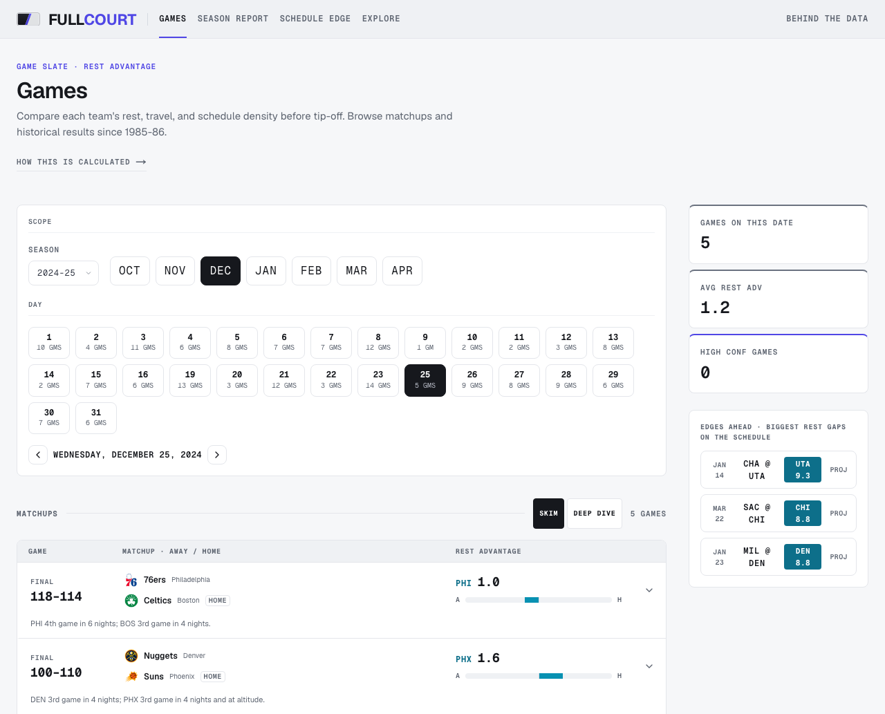
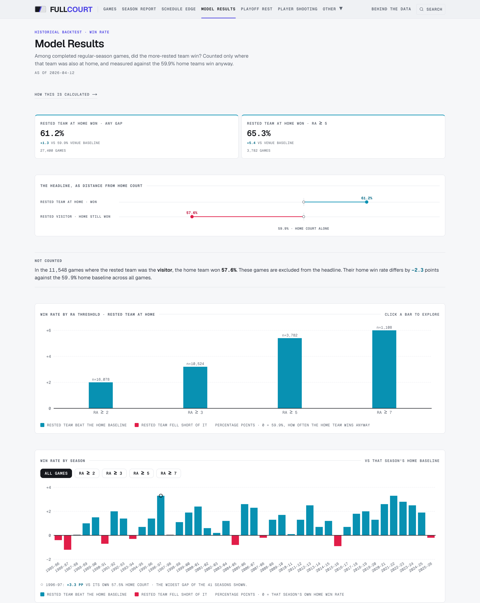
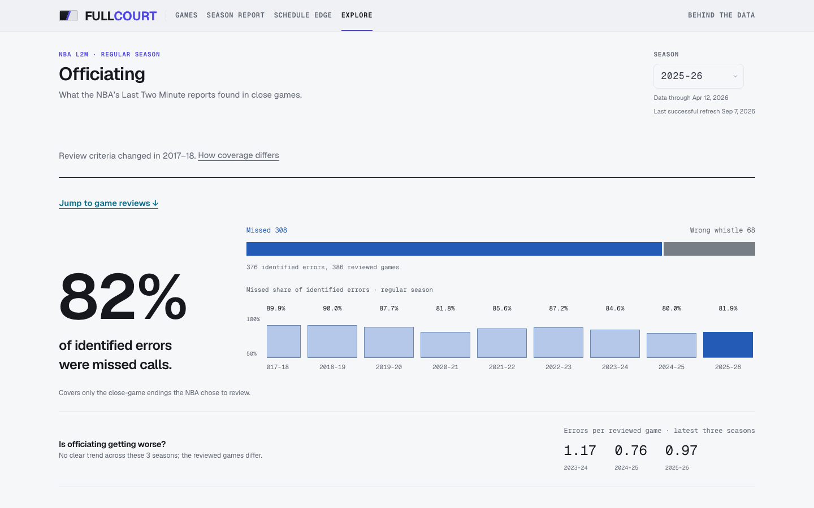
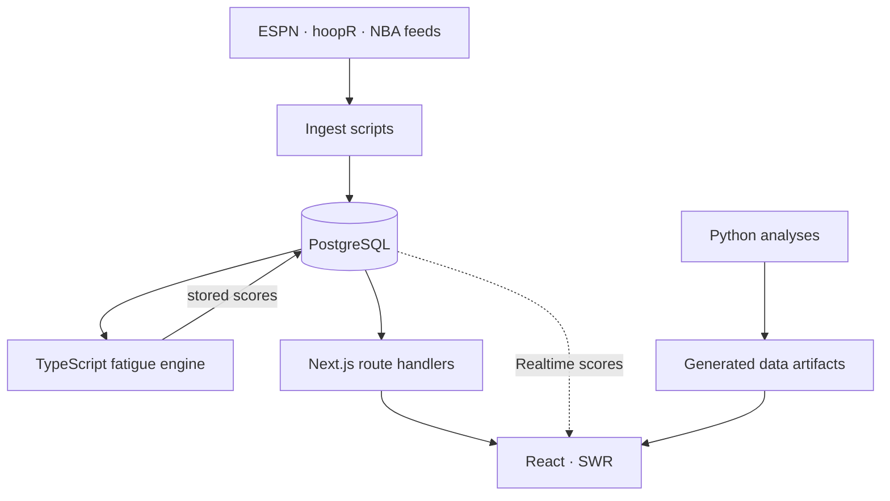

<div align="center">


# FullCourt

NBA analytics for rest, travel, and schedule density, checked against games since 1985-86.

[](https://github.com/mhju0/fullcourt/actions/workflows/ci.yml)
[](https://github.com/mhju0/fullcourt/actions/workflows/daily-update.yml)

[Open FullCourt](https://fullcourt-nba.vercel.app) · [Read the methods](https://fullcourt-nba.vercel.app/behind-the-data)

</div>

FullCourt scores each team's schedule load, compares the two teams in a matchup, and measures
how often the more-rested side won. It also examines playoff series, player shooting, shot
locations, missing rotation players, and officiating patterns.

Home court matters much more than rest. The regular-season model makes a call when the
more-rested team is at home; rested visitors are reported separately. Both win rates are
compared with their venue baselines. These are historical associations, not estimates of what
rest alone caused or a complete forecast of who will win.

The [Model Results page](https://fullcourt-nba.vercel.app/analysis) carries the current rates,
sample sizes, and season comparisons. [Behind the Data](https://fullcourt-nba.vercel.app/behind-the-data)
explains the calculations and publishes results that did not support a measurable effect.

## What you can examine

| Page | What it shows |
| --- | --- |
| [Games](https://fullcourt-nba.vercel.app/games) | Browse matchups by season and date, switch between summary and detailed views, and expand a game to inspect its schedule load. Edges Ahead jumps to upcoming games with large rest gaps. |
| [Season Report](https://fullcourt-nba.vercel.app/season) | Completed-season results against their home baseline, team rest records, and five notable completed games. Small samples are labeled. |
| [Schedule Edge](https://fullcourt-nba.vercel.app/schedule) | Within-season rest-edge ranking, schedule worth, travel and workload, and the completed-game fatigue calendar. Details expand on demand. |
| [Model Results](https://fullcourt-nba.vercel.app/analysis) | Rested-home and rested-visitor win rates by rest gap and season, compared with venue baselines, plus a searchable game record. |
| [Playoff Rest](https://fullcourt-nba.vercel.app/playoffs) | Previous-round workload and a separate series probability model. Its probabilities improve on the historical base rate, while its overall accuracy is close to always choosing the home-court team. |
| [Player Shooting](https://fullcourt-nba.vercel.app/shooting) | Effective field goal percentage on no rest versus three or more days off. Rest comes from each player's appearances. Single-season splits are noisy; career estimates use shrinkage toward the league mean. |
| [Shot Value](https://fullcourt-nba.vercel.app/shot-quality) | Expected shooting value by court location. The model does not observe defender distance, shot-clock pressure, or shot difficulty beyond location. |
| [Availability Cost](https://fullcourt-nba.vercel.app/availability) | The estimated margin associated with a missing rotation player, controlling for team strength and schedule factors. Absences are identified after games, so this is not a lineup forecast. |
| [Officiating](https://fullcourt-nba.vercel.app/officiating) | NBA Last Two Minute report findings by season, team, and call type, with the NBA’s verdicts inside each game. Covers selected close-game endings; earlier referee studies remain in the research archive. |

## Screenshots

These captures illustrate the interface at the time they were taken. Use the live pages for
current data and controls.







## How the fatigue score works

The score combines recent workload, travel distance, time between games, schedule density,
altitude, extended road trips, and time away from the team's home time zone. Prior-game
overtime and margin affect workload; longer breaks reduce it. Travel is estimated from game
locations, not flight records.

Regular-season fatigue scores exclude playoff games and the 2019-20 Orlando bubble. Ordinary
games played before that season's suspension remain included. Schedule Edge excludes the
whole interrupted season from its team ranking because teams played unequal numbers of games.
Some inputs, including overtime and tip-off times, are unavailable in earlier seasons.

The [rest-advantage method](https://fullcourt-nba.vercel.app/behind-the-data/rest-advantage)
documents the terms, coefficients, and tests. A weight-fitting study did not establish enough
improvement to replace the ratified model; its protocol and amendments are preserved in
[ADR 0006](docs/adr/0006-fatigue-weights-were-fitted-and-the-model-was-not-changed.md).

## Architecture


```mermaid
flowchart TD
    feeds["ESPN · hoopR · NBA feeds"] --> ingest["Ingest scripts"]
    ingest --> db[("PostgreSQL")]
    db --> fatigue["TypeScript fatigue engine"]
    fatigue -->|"stored scores"| db
    db --> api["Next.js route handlers"]
    api --> ui["React · SWR"]
    db -.->|"Realtime scores"| ui
    offline["Python analyses"] --> artifacts["Generated data artifacts"]
    artifacts --> ui
```

The fatigue engine in `src/lib/fatigue.ts` computes scores on the write path. Pages read the
stored results. Other analyses use dedicated queries or generated artifacts; player shooting,
availability, and referee results do not require their own runtime database queries.

| Layer | Implementation |
| --- | --- |
| Interface | Next.js 16, React 19, TypeScript, Tailwind CSS v4, Base UI, Recharts, SWR; GSAP on the front page |
| Data access | Next.js route handlers, Zod, Drizzle ORM, postgres-js, Supabase PostgreSQL |
| Ingest and analysis | Python and TypeScript scripts; scikit-learn models run offline |
| Checks | Vitest, Playwright, Python contracts |
| Hosting and scheduled jobs | Vercel and GitHub Actions |

See [Architecture](docs/ARCHITECTURE.md), [Data Pipeline](docs/DATA_PIPELINE.md), and
[Testing and CI/CD](docs/TESTING_AND_CICD.md) for implementation details.

## Run locally

Use the pnpm version pinned in `package.json`. CI uses Node 22 and Python 3.11.

```bash
pnpm install --frozen-lockfile
cp .env.example .env.local
# Set DATABASE_URL for a populated database.
pnpm dev
```

Open [localhost:3000](http://localhost:3000). Database-backed pages need populated data;
optional public Supabase settings enable live score updates.

The repository has no automatic database bootstrap. `src/lib/db/schema.ts` is deliberately
incomplete, and `drizzle/` contains manual SQL records. Do not run `drizzle-kit push` or
`generate`. Follow [Database](docs/DATABASE.md) and apply SQL manually in a dedicated database.

```bash
pnpm lint
pnpm typecheck
pnpm test:run
pnpm build
pnpm audit --prod
```

`pnpm test:e2e` starts its own server and needs a populated database. To test an existing
server, set `PLAYWRIGHT_BASE_URL`. Python requirements and contract-test commands are in
[Testing and CI/CD](docs/TESTING_AND_CICD.md).

## Repository map

| Directory | Contents |
| --- | --- |
| `src/app/` | Pages, metadata, and API routes |
| `src/components/` | Tables, charts, navigation, and shared controls |
| `src/lib/` | Fatigue model, database access, formatting, and analysis helpers |
| `src/hooks/` | Data loading, live scores, and browsing state |
| `scripts/` | Ingest, backfills, data generation, and maintenance |
| `ml/` | Offline analyses, reports, and pre-registrations |
| `src/data/`, `public/data/` | Generated analytics artifacts |
| `drizzle/` | SQL for manual application |
| `docs/` | Current documentation, decisions, and historical design records |
| `anti-slop/` | Project-local review skills and audit reports |

## Credits and license

Built by [Michael Ju](https://github.com/mhju0).

The interface uses Geist and Geist Mono. The bundled Geist fonts used for social images are
copyright 2023 Vercel, Inc. and licensed separately under the
[SIL Open Font License 1.1](src/app/fonts/OFL.txt).

Copyright (c) 2026 Michael Ju. All rights reserved. No license is granted for use, copying,
modification, or distribution of this code. The repository is public for portfolio review.
