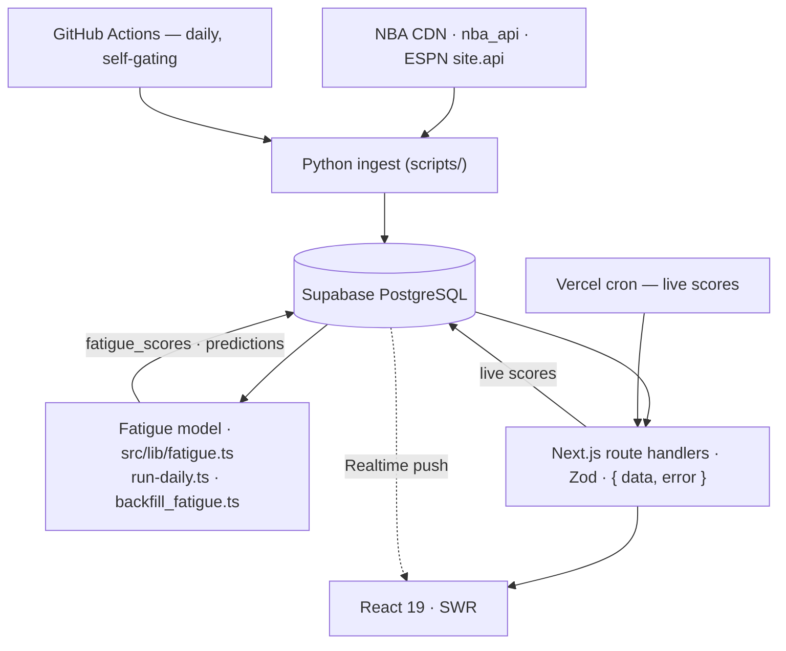

<div align="center">


# FullCourt

**An NBA analytics platform that turns four decades of schedule data into game-level predictions.**

[](https://github.com/mhju0/fullcourt/actions/workflows/ci.yml)
[](https://github.com/mhju0/fullcourt/actions/workflows/daily-update.yml)


</div>

FullCourt quantifies how **travel, rest, and schedule density** shape NBA outcomes. Its flagship model assigns every team a multi-factor **fatigue score**, derives a **rest advantage** for each matchup, and backtests it against every NBA season since 1985-86.

> **The finding:** where the model makes a call, the more-rested team wins the majority of games —
> and the gain grows as the rest-advantage gap widens, up to about **5 points**, past which it is
> flat. The call is deliberately one-sided: since 2026-08-02 the model counts a game only when the
> fresher team is also at home, because a rested road team still loses more often than it wins and
> folding home court into the score instead performs worse than simply backing the home team.
> Every rate is computed live from the database rather than typed here; as the screenshots below
> show, that ran **61.2%** overall and **65.3%** at a 5+ gap, with the other row published beside
> it at **42.4%**.
>
> Read both against a venue baseline, never against a coin flip. Home teams win **59.9%** of all
> games regardless of rest and road teams **40.1%**, so those rates are worth **+1.3** and
> **+2.3** points respectively — the part attributable to rest. `/analysis` plots against that
> baseline for exactly this reason.
>
> **Scale, stated the same way for both factors.** Swapping which side is rested moves a home
> team's win probability **3.6 points**; swapping the venue moves it **19.8**. So a rest edge is
> worth just under **a fifth of home court** — real, and much smaller than the thing every fan
> already prices in. Spread across a season the league keeps close to even, that comes to **under
> half a win** for every team in the league, which `/season` and `/schedule` both publish per team.
> The small number is a fact about the calendar, not about fatigue.
>
> A **44.4% across 7,224 games** figure appears in [ADR 0006](docs/adr/0006-fatigue-weights-were-fitted-and-the-model-was-not-changed.md)
> and its 2026-08-06 addendum. It is the *2002-03-onward* harness slice, not the published
> population, and it should not be quoted as the site's figure. `src/lib/rest-split-facts.ts`,
> pinned against a generated artifact, holds the current numbers.

🔗 **Live demo:** https://fullcourt-nba.vercel.app &nbsp;·&nbsp; **Code:** https://github.com/mhju0/fullcourt

> **Project status:** actively developed. **All nine product surfaces are published and
> complete** — no stubs, no placeholders, no coming-soons. Referee Effect was the last one held
> back, from 2026-07-30 until it shipped on 2026-08-22 with the writing its numbers needed; every
> published surface now also has a method page under `/behind-the-data`. The live demo and
> scheduled data pipeline are operational, and new analytics modules are built as additive,
> isolated slices — their own scripts, tables, routes, and page — so they never destabilize the
> flagship rest-advantage flow.
>
> **2026-27 is seeded:** 1,200 games ingested from ESPN on 2026-08-18 and cross-checked against a
> second source. Both NBA-owned endpoints remain blocked from outside the US *and* from CI, so the
> schedule is keyed `espn-<eventId>` and the nightly score path matches on (date, away, home)
> rather than on a league game id. One consequence is deliberate and scheduled: Shooting by Rest
> carries no 2026-27 rows until those games are re-keyed in January, because its source joins on
> ids that only exist for played games. See
> [docs/SEASON_ROLLOVER.md](docs/SEASON_ROLLOVER.md) §3 and §9.

---

## Demo

All nine surfaces are live. The screenshots below cover the ones whose layout carries the most
information; every route is reachable from the nav.

**Games — the per-matchup view.** One row per game: each team's fatigue score and the schedule
flags behind it, the rest-advantage differential, and a confidence read. Expanding a row gives
both teams' fatigue components and the historical hit rate and sample size of that matchup's
class; matchups the model calls neutral get no claim at all.


**Season Report — one season as it was played.** How that year's rest call scored against the
all-season norm, **what the schedule was worth in wins** (the season's extremes; the full
per-team pricing lives on Schedule Edge), and which teams converted a rest edge. Every rate is
gated on sample size: below 100 decidable games a tile reads "too early to call" rather than
inventing a verdict.


**Schedule Disparity — who the schedule favored.** All 30 teams ranked by net edge games,
drawn from a zero line so the bar length *is* the edge, and priced in wins beside it. Positive is
favorable in every column on the page.


**Model Results — the full-history backtest behind the headline finding.** Win rate by rest-advantage
threshold, plotted as the gap against **what that side wins anyway** in percentage points: zero is
the home baseline, not a coin flip, because every game counted here is one the rested team played
at home. The bar's length is the part rest accounts for. Slices below the baseline hang under the
line in red.


**Playoff Rest — what surviving a long series costs the round after.** The page leads with the
argument, not the bracket: every playoff game after Game 1 is played on equal rest by
construction, so the only rest signal left is how far each team's previous round ran. The
home-court team's series win rate climbs from 68.9% to 85.4% depending on whether its opponent
closed out early or went the distance, the effect survives holding a team's own result fixed, and
the model's bracket picks below carry that gain.


**Player Shooting — a lookup, not a ranking.** Every player's eFG% on zero rest beside three or
more days off, with the split's sample size shown on both sides so a thin season reads as thin.


**Expected Shot Value — location-only xeFG%.** A gradient-boosted location model beside the
zone-average baseline it is measured against.


**Availability Cost — every effect this site measures, in one unit.** Losing your best player
against playing at home, a back-to-back, thin air and an overtime, all in points of final margin
so they can be read against each other directly. The page also answers the standing objection to
the whole premise — that the schedule effects are really absences in disguise.


**Referee Effect — what actually separates officials.** The mix of fouls each one calls against
the league's own seasonal mix, when in a game the whistle arrives, and a folklore chapter that
tests the sport's loudest claims about named referees. Every extreme record is published with the
record chance produces beside it — a rule enforced by a test rather than by editorial care.


---

## Features

Nine product routes sit behind six direct nav tabs plus an **OTHER** menu, which holds the
smaller reference surfaces so the bar stays short as they accumulate. Labels are plain nouns
with no time words — the pattern every mainstream NBA nav uses — while the precise terms
(`xeFG%`, net rest edge) live in each page's eyebrow, where surrounding context decodes them.

- **Games** (`/games`) — the slate as one continuous table: a row per game carrying both fatigue
  scores, the schedule flags behind them, a rest-advantage gauge and a confidence read, with
  real-time score/status updates via Supabase Realtime. It was a stack of cards until 2026-08-09;
  the table is the Front Office redesign's spine, and a row expands in place rather than opening
  anything. Browses any season back to 1985-86 by date, and
  carries an **UPCOMING** view: the remaining schedule in date order, filterable to a minimum
  rest-advantage gap, each game shown with the historical hit rate and sample size of its
  rest-advantage class. Not
  betting advice. (This view is the retired `/upcoming` route, which now redirects here.)
- **Season Report** (`/season`) — one season as it was played: how the rest call scored that year
  against the all-season norm, **what the schedule was worth in wins** (stated as the season's
  extremes — the full per-team pricing has its one home on Schedule Edge), which teams
  converted a rest edge, and the nights the league played on zero rest. Honest framing: a
  single season is a small sample, so every rate tile is gated at a minimum game count and the
  verdict says "too early to call" rather than inventing one. The rest-edge conversion table is
  read against a **stated baseline of about +10 points, not against zero** — its rested arm is
  played at home and its tired arm on the road, so a team with no rest-conversion skill at all
  still posts a double-digit swing.
- **Schedule Edge** (`/schedule`) — which teams a season's schedule favored, ranked by **net edge
  games**: games arrived at with a real rest edge, minus games played against one, with
  back-to-back and short-rest differentials beside it, and the same net **priced in wins**.
  Honest framing: it describes the schedule rather than predicting anything, much of the gap is
  structural rather than anyone being favored, and every figure is scoped to its own season —
  season length, team count and the league-wide rest distribution all shifted across four
  decades, so there is deliberately no all-time ranking. The wins figure never leaves ±0.4 for
  any team, and that is a fact about the calendar rather than about fatigue: the league hands out
  rest edges evenly enough that a real per-game effect never accumulates.
- **Model Results** (`/analysis`) — the historical backtest that scores the rest model: win rate by
  rest-advantage threshold and by season, the half the model declines (a rested visitor), and a
  filterable game explorer.
- **Playoff Rest** (`/playoffs`) — what surviving a long series costs the round after, argued
  before the bracket rather than under it. Every playoff game past Game 1 is played on equal rest
  by construction, so the only rest signal left is how far each team's previous round ran, read
  format-aware (Round 1 was best-of-five through 2001-02). The home-court team's series win rate
  in rounds 2+ runs 68.9% when both sides closed early against 85.4% when only the opponent went
  the distance, and the gap survives narrowing to evenly-matched series. Below the argument sits
  the bracket: a four-feature logistic at series grain, still driven mainly by regular-season
  record (`win_pct_diff` outweighs the one rest-shaped input, `prior_grind_diff`, about two and a
  half to one). Honest framing: the model's gain lives where a prior round exists to have been
  ground down by — 73.3% against a 69.5% always-pick-the-home-court baseline over 210 rounds-2+
  series, per-season 11-16-3 — and it *loses* in Round 1, 77.1% against 78.8%, where the feature
  is zero for every row. Pooled over 30 seasons predicted in advance that nets out to 75.3% vs
  74.4%, a tie inside the noise; the durable win is calibration, log loss 0.5696 → 0.4939 (~13%)
  and Brier 0.1907 → 0.1628 (~15%). The page leads with the finding and the bracket; the full
  argument — the round split, the confound test and the calibration table — sits one link away at
  `/behind-the-data/playoff-predictions`.
- **Shot Value** (`/shot-quality`, under **OTHER**) — a half-court grid map of expected effective FG% per 1-ft cell, comparing a location-only gradient-boosted model against a zone-average baseline. Honest framing: public NBA data has no defender distance or shot-clock signal, so this is shot-**location** value only, and the model's edge over the baseline is a small calibration win (~1% on log-loss / Brier), not a large accuracy jump.
- **Player Shooting** (`/shooting`) — a browsable database of every player's eFG% on zero rest
  against three or more days off, for any season since 1996-97 or pooled across a career. Rest is
  the player's **own**, counted from the games he actually played, so a night off for load
  management is never credited to him as rest. Honest framing: a single season's split carries a
  standard error near 7 pp and correlates with the same player's next season at roughly zero, so
  the page is a lookup rather than a ranking — a season describes what happened, and only the
  career line, shrunk toward the league mean, supports a claim.

- **Availability Cost** (`/availability`, under **OTHER**) — what a missing rotation player costs,
  measured in the same points of final margin as the schedule terms so the two can be read against
  each other. Losing a team's best player is worth **2.86 points**, against home court's **2.82** —
  the finding is that they land within 0.04 of one another. It also answers the standing objection
  to the whole premise: putting absence and the schedule terms in one regression moves every
  schedule coefficient by under 8%, so load management explains almost none of what a back-to-back
  costs. Honest framing: **retrospective by construction**. Who sat is known only because the game
  was played, so this measures what an absence cost and never forecasts who will be available
  tonight — and a 13.64-point margin standard deviation against a 12.44 residual says everything
  here, team strength included, explains a small share of a basketball game.
- **Referee Effect** (`/referees`, under **OTHER**) — what separates officials, in three
  chapters. The **mix** of foul calls each one makes against the league's own seasonal mix; **when**
  in a game the whistle arrives (officials differ at the ends of a game, not the middle); and a
  **folklore** chapter that tests the sport's loudest claims about named referees against 13,114
  regular-season and 913 playoff games. Held back from 2026-07-30 to 2026-08-22 precisely because
  a table of per-official numbers without its framing invites the bias reading the page exists to
  refuse — three officials work every game and the play-by-play never records which one blew the
  whistle, so each figure is roughly a third of the real effect. Published under two
  pre-registrations that fixed what could be asked *before* it was asked
  ([ADR 0007](docs/adr/0007-referee-analysis-axes-are-pre-registered.md),
  `ml/referee_player_preregistration.md`), and every null is published alongside the findings.
  The headline is one: **the most famous referee-and-player record in basketball is real, is the
  most lopsided of 689 pairs, and is still not more extreme than the maximum a grid that size
  produces from nothing.** No extreme pair is ever quoted without that number beside it, and a
  test fails if one is.

Each analytics module is **additive and isolated** — its own scripts, tables, routes, and page — so new modules never destabilize the flagship rest-advantage flow.

Two routes sit outside that set: **`/`**, the front door, which explains what the product
measures, and **`/behind-the-data`**, the method pages behind each module — one per published
surface, with no exceptions since 2026-08-22. Neither is a tab —
`/` is reached from the wordmark and the footer, `/behind-the-data` from a reference link
right-aligned in the nav row. `/` reads its three evidence figures from the same backtest
`/analysis` renders. It lived at `/about` until 2026-08-12, which still redirects here.

---

## Architecture


```mermaid
flowchart TD
    src["NBA CDN · nba_api · ESPN site.api"] --> ingest["Python ingest (scripts/)"]
    ingest --> db[("Supabase PostgreSQL")]
    db --> model["Fatigue model · src/lib/fatigue.ts<br/>run-daily.ts · backfill_fatigue.ts"]
    model -->|"fatigue_scores · predictions"| db
    db --> api["Next.js route handlers · Zod · { data, error }"]
    api -->|"live scores"| db
    api --> ui["React 19 · SWR"]
    db -.->|"Realtime push"| ui
    cron["GitHub Actions — daily, self-gating"] --> ingest
    vercel["Vercel cron — live scores"] --> api
```

- **Ingest (Python + TypeScript):** ESPN supplies upcoming schedules, daily scores, overtime periods, tip-off times and neutral-site venues; hoopR supplies historical box scores. The NBA-owned ingest paths remain in the repository but were blocked from both Seoul and CI at the last probe. A daily GitHub Actions job **self-gates on the NBA season**: the gate first tries the NBA CDN schedule and falls back to an October–April calendar window if it fails. Offseason runs exit before database access or score ingestion, with no cron cadence to toggle.
- **Model (TypeScript):** one fatigue engine (`src/lib/fatigue.ts`) with exactly two production callers, both writers — the nightly refresh (`run-daily.ts`) and the bulk backfill (`backfill_fatigue.ts`). A score is computed once, written to `fatigue_scores`, and every read serves that stored row, so there is no second copy of the math on the read path to drift from.
- **Store:** Supabase PostgreSQL with Row-Level Security; reads run as type-safe Drizzle queries.
- **Serve:** Next.js App Router route handlers (Zod-validated, `{ data, error }` envelope) feed a React 19 frontend using SWR and Supabase Realtime.
- **Ship:** Vercel auto-deploys from `main`; GitHub Actions runs the daily pipeline.

The diagram above is the flagship rest-advantage flow. Playoff Predictor, Shot Quality, Schedule
Disparity, Shooting by Rest, Availability Cost and Referee Effect are separate routes/pages that
never touch `fatigue.ts` and are never read by the flagship queries; see
[docs/ARCHITECTURE.md](docs/ARCHITECTURE.md) for their data flows. Schedule Disparity adds no
table, no migration and no ingest — it derives everything from the existing `games` and
`fatigue_scores` reads. Three others do not query the database at all: Shooting by Rest is served
entirely from a committed static asset (`public/data/player-rest.json`) built offline from
[hoopR](docs/adr/0002-shooting-source-hoopr.md), Availability Cost ships as a generated constants
module (`src/lib/availability-facts.ts`) pinned by a test against the artifact that produced it,
and Referee Effect reads three committed JSON artifacts (`referee-foul-style.json`,
`referee-timing.json`, `referee-legends.json`) written by its ingest and analysis scripts. Those
three add nothing to the runtime query path.

---

## The fatigue model

Each team's score combines:

- **Workload** — exponential decay over the last 30 days (recent games weigh more).
- **Travel** — log-scaled great-circle miles, with a realistic travel contract: a team only flies home when its *next* game is at home (no phantom round-trips between two road games).
- **Back-to-backs & altitude** — a one-day-rest multiplier sharpened by the *actual* hours between tips (a 10:30pm game into a 7pm game is not the same as the reverse), plus multipliers for visiting Denver, Utah or Mexico City, and a smaller residual the night after.
- **Schedule density** — a stress multiplier across five windows (6, 7, 12, 15 and 30 days)
  measured against a normal-pace anchor. Each window is clamped before the curve is applied, so
  the multiplier tops out near 1.31 on real schedules. The 3-in-4 and 4-in-6 flags are
  reported alongside it, not inputs to it.
- **Road trips & body clock** — added load for long road stretches, plus a circadian charge for playing two or more time zones from home. It is heavier travelling east than west, and it decays as the team re-entrains, at roughly a day per zone crossed.
- **Freshness & game difficulty** — a rest discount for extended breaks, and prior-game load weighted by how hard the game actually was: overtime adds, a blowout that rested the starters subtracts.

Data spans **1985-86 to the present**, excluding every playoff/finals game from the fatigue model (a fixed two-team series breaks the travel assumptions) and the **2019-20 Orlando bubble** — 88 games at a single site, with no travel to measure and no home crowd.

That exclusion is the bubble, not the season ([ADR 0004](docs/adr/0004-season-exclusions-belong-to-modules-not-ingest.md)). The 971 games 2019-20 played before the March 2020 suspension were reached by flying to them and are fully in. One surface still withholds the season in full: **Schedule Edge** ranks teams against each other within a season, and 2019-20 stopped with teams having played between 63 and 67 games, so a team with four fewer games would carry four fewer chances to accumulate an edge. Every other season is within a single game of even. 2020-21 is included — ordinary travel, compressed into 72 games — as are the 1998-99 and 2011-12 lockout seasons: short is fine, interrupted is not.

Three inputs — overtime, tip-off times and neutral sites — come from ESPN, whose coverage starts around 2002. Earlier seasons are scored by the same formula without them, which is a deliberate, documented trade rather than a silent gap: see [ADR 0003](docs/adr/0003-fatigue-inputs-limited-to-espn-era.md).

The model was overhauled on 2026-07-30 — real time zones in place of a longitude proxy, a
circadian term that decays as teams acclimate, prior-game load weighted by margin, and an
overtime penalty that had shipped years earlier but never once fired, because its data source
was unreachable and every game read zero overtime. Honest framing of the result: on games both
the old and new model call, accuracy moved **+0.15pp** and the two pick the same team 98.8% of
the time. The published hit rates rise about a point because the new model **abstains** from
2,661 games the old one called at 49% — below a coin flip. That is better selectivity, not
better prediction, and it is worth more to a site whose premise is only claiming an edge where
one exists.

Two changes followed on **2026-08-02**, both on measurement rather than taste. The model
**stopped calling a game when the fresher team is the visitor** — backing a rested road team ran
42.4% across 11,548 games, and folding home court into the score instead covers 96.5% of games at
59.7%, below the 59.9% from simply backing the home team every time. That row is published on
`/analysis` as its own row rather than quietly dropped. And
`ALTITUDE_MULTIPLIER` rose **1.15 → 1.29**, the first ratified coefficient ever changed on
evidence: measured on final margin, altitude is worth 1.358 points against a back-to-back's
1.759, a ratio of 0.772 where the model was charging 0.405.

Those are the changes that survived. A weight-fitting harness was also built and run
out-of-sample, and it **did not change the model** — fitted weights do not beat the ratified ones
by enough to matter, and most of the model's terms carry no independent signal at all. That null
is written down in [ADR 0006](docs/adr/0006-fatigue-weights-were-fitted-and-the-model-was-not-changed.md)
so the question is not reopened from scratch.

---

## Tech stack

| Layer | Tech |
|-------|------|
| Frontend | Next.js 16 (App Router), React 19, TypeScript (strict), Tailwind CSS v4, Base UI (the `button` and `nav` primitives, seeded from shadcn and trimmed to the call sites this app has), Recharts, SWR, GSAP (dynamically imported, `/` only) |
| API | Next.js route handlers, Zod validation, Drizzle ORM, postgres-js |
| Database | Supabase PostgreSQL — Row-Level Security + Realtime |
| Data pipeline | Python (`nba_api`, `pandas`) + TypeScript (`tsx`) |
| Modeling | scikit-learn — `HistGradientBoostingClassifier` in `scripts/` (Shot Quality), logistic regression in `ml/` (Playoff Predictor), and fixed-effects OLS in `ml/` (Availability Cost, the fatigue weight-fitting harness); Python-side only, never the app's runtime deps |
| Testing | Vitest (unit + route), Playwright (e2e) |
| Infra | Vercel, GitHub Actions |

---

## Engineering highlights

- **End-to-end type safety** — Drizzle ORM + Zod + strict TypeScript, from DB column to API response.
- **Single source of truth** — one fatigue engine with two callers, both on the write path: a score is computed once and stored, and every read serves that row. No read-path copy of the model math exists to drift from the write path.
- **Self-gating pipeline** — the daily GitHub Actions job checks the NBA CDN schedule, with a calendar fallback, and exits in the offseason before database access or score ingestion. It runs year-round with no manual cron changes.
- **Query performance** — hot read paths use `LEFT JOIN LATERAL … ORDER BY … LIMIT 1` against a composite index to fetch the latest fatigue row per team, replacing full-table `DISTINCT ON` scans — verified byte-for-byte identical output before/after.
- **Data integrity** — the 40 seasons audited to date are reconciled against an independent source (Basketball-Reference, 340 monthly pages, cross-checked with ESPN); 2019-20 was admitted after that audit and is queued for the next run to catch timezone date-shift bugs a sampled check would miss; game dates are stored in US/Eastern end-to-end with a self-healing upsert (`date = EXCLUDED.date`), so a re-run repairs any mis-dated row.
- **Security** — Supabase RLS with explicit Data API grants (anon read, service-role writes); a Content-Security-Policy + `X-Frame-Options: DENY`, and a constant-time comparison on the cron bearer token.
- **Real-time** — score and status changes push to the browser through Supabase Realtime.
- **Tested & shipped** — Vitest unit/route + Playwright e2e (run locally); ships via Vercel (auto-deploy + a live-score cron) and a scheduled GitHub Actions data pipeline.

---

## Getting started

```bash
pnpm install
cp .env.example .env.local
# Fill DATABASE_URL, then optionally add the public Supabase Realtime values.
pnpm dev
```

Open http://localhost:3000. A populated Supabase PostgreSQL database is required for product data.
The repository intentionally has no one-command database reset/bootstrap: its committed SQL files
are incremental and production-compatible, and `schema.ts` intentionally lags two live tables and
one index. Do **not** run `drizzle-kit push` or `generate`; follow
[`docs/DATABASE.md`](docs/DATABASE.md) and apply required SQL manually in a dedicated Supabase
project. Ingest and model commands are documented in
[`docs/DATA_PIPELINE.md`](docs/DATA_PIPELINE.md).

### Validation

```bash
pnpm lint
pnpm typecheck
pnpm test:run
pnpm build
```

Playwright is integration-style and requires the running app plus populated database:
`pnpm test:e2e`.

---

## Project structure

```
src/
  app/            # App Router pages + typed API route handlers
  components/     # the matchup table, fatigue bars, nav, charts, shot-quality court
    ui/           # the shared primitives — DataTable draws every table on the site
  lib/
    fatigue.ts    # the fatigue model (single source of truth)
    db/           # Drizzle schema, queries, client
  hooks/          # Supabase Realtime + the game-slate controller
scripts/          # Python ingest + TypeScript modeling + Shot Quality / Shooting pipelines
ml/               # Playoff Predictor series modeling, the Availability Cost measurement, the
                  # referee analyses + their pre-registrations, and the fatigue weight-fitting
                  # harness (isolated venv, scikit-learn) + gitignored cache
src/data/         # bundled analytics artifacts (referee whistle / foul style / timing / legends,
                  # win-total benchmark)
src/lib/          # availability-facts.ts and playoff-rest-facts.ts — generated figures pinned by tests
public/data/      # the static asset /shooting fetches at runtime (player-rest.json)
drizzle/          # SQL migrations (RLS, grants, indexes)
docs/             # architecture, database, pipeline, API, frontend, ADRs
                  # screenshots regenerate with `node scripts/screenshots.mjs` against a running
                  # app (`pnpm build && pnpm start`) and a populated database. Each capture ends
                  # on a named element, not a pinned height, so it throws rather than cropping
                  # mid-content when a layout changes. Override the host with SCREENSHOT_BASE_URL.
```

---

## Modules

- [x] **Rest Advantage model** (flagship) — fatigue score + rest-advantage backtest
- [x] **Playoff Predictor** — series win-probability model (record-driven logistic) at `/playoffs`
- [x] **Shot Quality** — Expected Shot Value / xeFG% half-court grid map at `/shot-quality`
- [x] **Schedule Disparity** — net edge games per team-season at `/schedule`
- [x] **Shooting by Rest** — per-player eFG% split by his own rest at `/shooting`
- [x] **Season Report** — one season end to end: the rest call, which teams converted an edge,
      and what the schedule cost each of them, at `/season`
- [x] **Availability Cost** — what a missing rotation player costs in points of margin, at
      `/availability`
- [x] **Referee Effect** — what separates officials, at `/referees`: the foul mix, when in a game
      the whistle arrives, and a folklore chapter testing the sport's loudest claims about named
      referees against 913 playoff games. Published 2026-08-22 after being deliberately held back
      for three weeks, under two pre-registrations that fixed the questions before they were asked.

---

Built by **Michael Ju** ([@mhju0](https://github.com/mhju0)).

The interface is set in **Geist** (body and headings) and **Geist Mono** (data and labels), both
loaded through `next/font/google` — no font files are committed for them. One family carries the
whole UI: titles separate from body text by weight and size rather than by face, which is the
"Front Office" direction adopted on 2026-08-09. It replaced Inter + Space Grotesk + IBM Plex Mono.

The bundled [Geist](https://github.com/vercel/geist-font) font faces in `src/app/fonts/` are
© 2023 Vercel, Inc. and licensed separately under the
[SIL Open Font License 1.1](src/app/fonts/OFL.txt). They render the social/OG card, which is
generated at the edge and cannot use `next/font`, so its faces have to be committed. Outfit was
bundled here for the same purpose until 2026-08-19, when the card moved onto the product's one
type family and Outfit was retired.

---

## License

Copyright (c) 2026 Michael Ju. All rights reserved.
No license is granted for use, copying, modification, or distribution of this code as of 2026-07-30. This repository is public for portfolio review purposes only.
