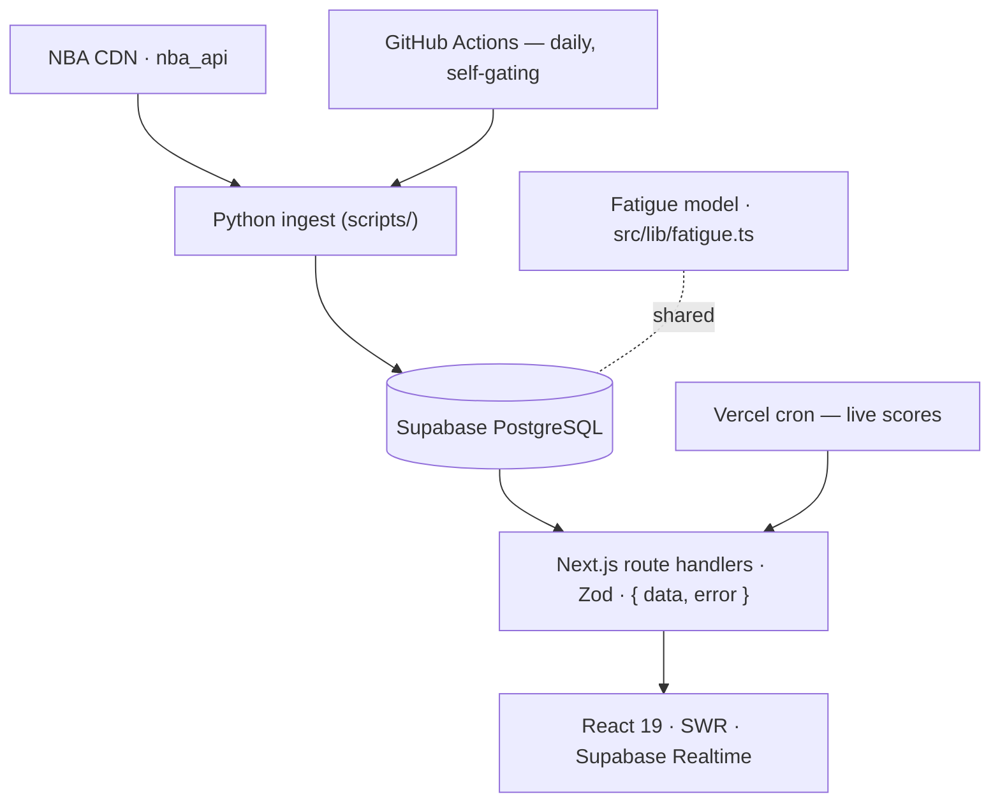

<div align="center">


# FullCourt

**An NBA analytics platform that turns four decades of schedule data into game-level predictions.**

[](https://github.com/mhju0/fullcourt/actions/workflows/ci.yml)
[](https://github.com/mhju0/fullcourt/actions/workflows/daily-update.yml)


</div>

FullCourt quantifies how **travel, rest, and schedule density** shape NBA outcomes. Its flagship model assigns every team a multi-factor **fatigue score**, derives a **rest advantage** for each matchup, and backtests it against roughly 40 seasons of regular-season results.

> **The finding:** the more-rested team wins the majority of games — and the edge widens once the rest-advantage gap reaches **5+ points**. These rates are computed live from the database and surfaced on the site (currently **~55% overall**, rising to **~61%** at a 5+ gap).

🔗 **Live demo:** https://fullcourt-nba.vercel.app &nbsp;·&nbsp; **Code:** https://github.com/mhju0/fullcourt

> **Project status:** actively developed. The live demo and scheduled data pipeline are
> operational, and new analytics modules are built as additive, isolated slices — their own
> scripts, tables, routes, and page — so they never destabilize the flagship rest-advantage flow.

---

## Demo

**Model Results — the 40-season backtest behind the headline finding.** Win rate by rest-advantage
threshold, plotted as the gap against a coin flip in percentage points: zero is a 50% win
rate, so the bar's length is the measured edge. Slices the model gets backwards hang below
the line in red.


**Games — the per-matchup view.** Each team's fatigue score, the rest-advantage
differential, and a confidence read. Every rest-advantage number carries the historical hit
rate and sample size of its class, measured against a 50% coin flip; matchups the model calls
neutral get no claim at all.


**Expected Shot Value — location-only xeFG%.** A gradient-boosted location model beside the
zone-average baseline it is measured against.


**Schedule Disparity — who the schedule favored.** All 30 teams ranked by net rest edge in days,
drawn from a zero line so the bar length *is* the edge. Positive is favorable in every column on
the page.


---

## Features

The five nav tabs below are the five product routes. Labels are plain nouns with no time
words — the pattern every mainstream NBA nav uses — while the precise terms (`xeFG%`, net rest
edge) live in each page's eyebrow, where surrounding context decodes them.

- **Games** (`/`) — live matchup cards with fatigue bars, a rest-advantage gauge, and real-time
  score/status updates via Supabase Realtime. Browses any season back to 1985-86 by date, and
  carries an **UPCOMING** view: scheduled games ranked by their predicted rest-advantage edge,
  each shown with the historical hit rate and sample size of its rest-advantage class. Not
  betting advice. (This view is the retired `/upcoming` route, which now redirects here.)
- **Schedule Edge** (`/schedule`) — which teams a season's schedule favored, ranked by **net rest edge**
  in days against their opponents, with back-to-back and short-rest differentials beside it.
  Honest framing: it describes the schedule rather than predicting anything, much of the gap is
  structural rather than anyone being favored, and every figure is scoped to its own season —
  season length, team count and the league-wide rest distribution all shifted across four
  decades, so there is deliberately no all-time ranking.
- **Model Results** (`/analysis`) — the historical backtest that scores the rest model: win rate by
  rest-advantage threshold and by season, home/away splits, and a filterable game explorer.
- **Playoff Predictions** (`/playoffs`) — series-winner predictions from rest/fatigue-derived features, showing walk-forward out-of-sample accuracy next to in-sample as an honest overfitting check.
- **Shot Value** (`/shot-quality`, Expected Shot Value / xeFG%) — a half-court hexbin map of expected effective FG% per grid cell, comparing a location-only gradient-boosted model against a zone-average baseline. Honest framing: public NBA data has no defender distance or shot-clock signal, so this is shot-**location** value only, and the model's edge over the baseline is a small calibration win (~1% on log-loss / Brier), not a large accuracy jump.

Each analytics module is **additive and isolated** — its own scripts, tables, routes, and page — so new modules never destabilize the flagship rest-advantage flow.

---

## Architecture


```mermaid
flowchart TD
    src["NBA CDN · nba_api"] --> ingest["Python ingest (scripts/)"]
    ingest --> db[("Supabase PostgreSQL")]
    model["Fatigue model · src/lib/fatigue.ts"] -. shared .- db
    db --> api["Next.js route handlers · Zod · { data, error }"]
    api --> ui["React 19 · SWR · Supabase Realtime"]
    cron["GitHub Actions — daily, self-gating"] --> ingest
    vercel["Vercel cron — live scores"] --> api
```

- **Ingest (Python):** `nba_api` and the NBA CDN feed schedules, scores, and overtime data into Postgres. A daily GitHub Actions job **self-gates on the NBA season** — it runs year-round on a fixed schedule but exits cleanly during the offseason (before touching the database or any API), so there is no cron cadence to toggle.
- **Model (TypeScript):** a single source-of-truth fatigue engine (`src/lib/fatigue.ts`) is shared by every pipeline writer *and* every API read, so the math is never duplicated.
- **Store:** Supabase PostgreSQL with Row-Level Security; reads run as type-safe Drizzle queries.
- **Serve:** Next.js App Router route handlers (Zod-validated, `{ data, error }` envelope) feed a React 19 frontend using SWR and Supabase Realtime.
- **Ship:** Vercel auto-deploys from `main`; GitHub Actions runs the daily pipeline.

The diagram above is the flagship rest-advantage flow. Playoff Predictor, Shot Quality and Schedule Disparity are separate routes/pages that never touch `fatigue.ts` and are never read by the flagship queries; see [docs/ARCHITECTURE.md](docs/ARCHITECTURE.md) for their data flows. Schedule Disparity is read-only — it adds no table, no migration and no ingest.

---

## The fatigue model

Each team's score combines:

- **Workload** — exponential decay over the last 30 days (recent games weigh more).
- **Travel** — log-scaled great-circle miles, with a realistic travel contract: a team only flies home when its *next* game is at home (no phantom round-trips between two road games).
- **Back-to-backs & altitude** — multipliers for one-day rest and for visiting Denver / Utah.
- **Schedule density** — a multi-window stress multiplier (3-in-4, 4-in-6).
- **Road trips** — added load for long road stretches and coast-to-coast swings.
- **Freshness & overtime** — a rest discount for extended breaks; a penalty when the prior game went to overtime.

Data spans **1985-86 to the present**, excluding the 2019-20 Orlando bubble (no real travel) and all playoff/finals games from the fatigue model (the fixed two-team series format breaks the travel assumptions).

---

## Tech stack

| Layer | Tech |
|-------|------|
| Frontend | Next.js 16 (App Router), React 19, TypeScript (strict), Tailwind CSS v4, shadcn/ui, Recharts, SWR |
| API | Next.js route handlers, Zod validation, Drizzle ORM, postgres-js |
| Database | Supabase PostgreSQL — Row-Level Security + Realtime |
| Data pipeline | Python (`nba_api`, `pandas`) + TypeScript (`tsx`) |
| Modeling (Shot Quality) | scikit-learn (`HistGradientBoostingClassifier`, logistic regression) — isolated to `ml/`, not the app's runtime deps |
| Testing | Vitest (unit + route), Playwright (e2e) |
| Infra | Vercel, GitHub Actions |

---

## Engineering highlights

- **End-to-end type safety** — Drizzle ORM + Zod + strict TypeScript, from DB column to API response.
- **Single source of truth** — one fatigue engine shared by pipeline writers and API reads, so the model math is never duplicated or drifts between write and read paths.
- **Self-gating pipeline** — the daily GitHub Actions job checks whether the NBA season is active and exits cleanly in the offseason (before touching the DB or any API), so it runs year-round with no manual cron changes.
- **Query performance** — hot read paths use `LEFT JOIN LATERAL … ORDER BY … LIMIT 1` against a composite index to fetch the latest fatigue row per team, replacing full-table `DISTINCT ON` scans — verified byte-for-byte identical output before/after.
- **Data integrity** — every one of the 40 seasons is reconciled against an independent source (Basketball-Reference, 340 monthly pages, cross-checked with ESPN) to catch timezone date-shift bugs a sampled check would miss; game dates are stored in US/Eastern end-to-end with a self-healing upsert (`date = EXCLUDED.date`), so a re-run repairs any mis-dated row.
- **Security** — Supabase RLS with explicit Data API grants (anon read, service-role writes); a Content-Security-Policy + `X-Frame-Options: DENY`, and a constant-time comparison on the cron bearer token.
- **Real-time** — score and status changes push to the browser through Supabase Realtime.
- **Tested & shipped** — Vitest unit/route + Playwright e2e (run locally); ships via Vercel (auto-deploy + a live-score cron) and a scheduled GitHub Actions data pipeline.

---

## Getting started

```bash
pnpm install
cp .env.example .env.local
# Fill DATABASE_URL, then optionally add the public Supabase Realtime values.
pnpm dev
```

Open http://localhost:3000. A populated Supabase PostgreSQL database is required for product data.
The repository intentionally has no one-command database reset/bootstrap: its committed SQL files
are incremental and production-compatible, and `schema.ts` intentionally lags two live tables and
one index. Do **not** run `drizzle-kit push` or `generate`; follow
[`docs/DATABASE.md`](docs/DATABASE.md) and apply required SQL manually in a dedicated Supabase
project. Ingest and model commands are documented in
[`docs/DATA_PIPELINE.md`](docs/DATA_PIPELINE.md).

### Validation

```bash
pnpm lint
pnpm typecheck
pnpm test:run
pnpm build
```

Playwright is integration-style and requires the running app plus populated database:
`pnpm test:e2e`.

---

## Project structure

```
src/
  app/            # App Router pages + typed API route handlers
  components/     # matchup cards, fatigue bars, nav, charts, shot-quality court
  lib/
    fatigue.ts    # the fatigue model (single source of truth)
    db/           # Drizzle schema, queries, client
  hooks/          # Supabase Realtime
scripts/          # Python ingest + TypeScript modeling + Shot Quality pipeline
ml/               # Shot Quality modeling (isolated venv, scikit-learn) + local shot cache
drizzle/          # SQL migrations (RLS, grants, indexes)
docs/             # architecture, database, pipeline, API, frontend
```

---

## Modules

- [x] **Rest Advantage model** (flagship) — fatigue score + rest-advantage backtest
- [x] **Playoff Predictor** — series-winner model (fatigue + ML) at `/playoffs`
- [x] **Shot Quality** — Expected Shot Value / xeFG% half-court hexbin at `/shot-quality`
- [x] **Schedule Disparity** — net rest edge per team-season at `/schedule`

---

Built by **Michael Ju** ([@mhju0](https://github.com/mhju0)). Licensed under the
[MIT License](LICENSE).

The bundled [Outfit](https://github.com/Outfitio/Outfit-Fonts) font faces in
`src/app/fonts/` (used to render the social/OG card) are © 2021 The Outfit Project Authors
and licensed separately under the [SIL Open Font License 1.1](src/app/fonts/OFL.txt).
