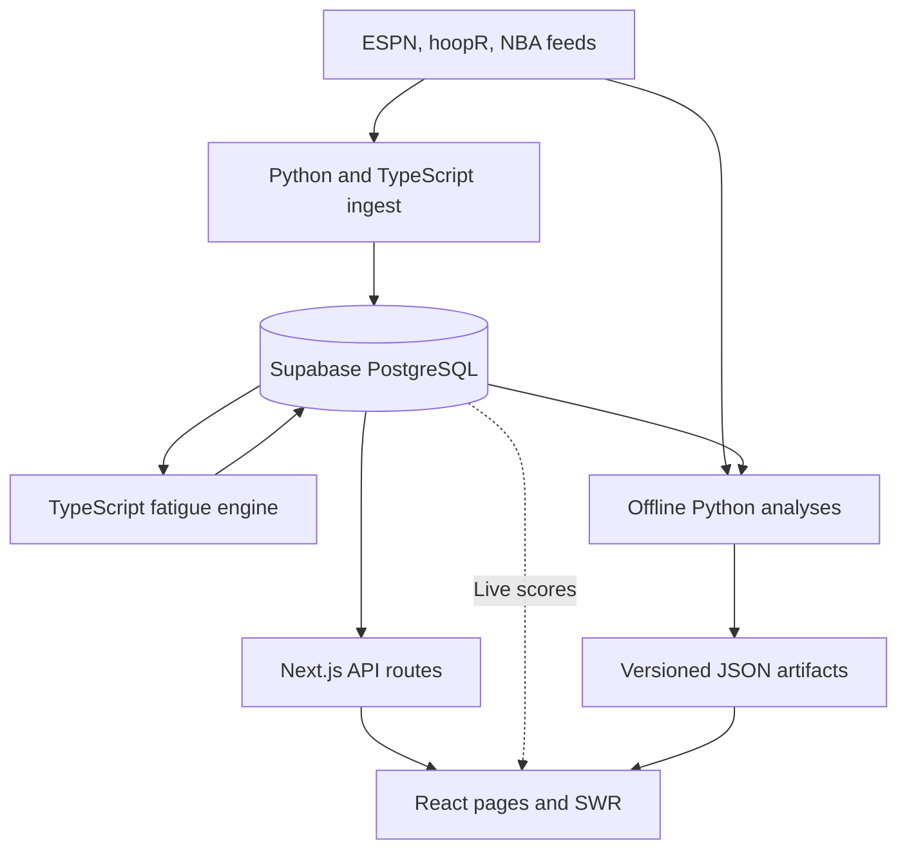

# Architecture

FullCourt is a read-only NBA analytics application. Source locations below define the current
implementation; [ADRs](adr/) retain rationale and evaluation protocols.

## Data flow

## Ownership

| Layer | Source | Responsibility |
| --- | --- | --- |
| Routes | `src/app/` | Page composition, metadata, API boundaries |
| Interface | `src/components/`, `src/hooks/` | Tables, charts, navigation, loading and exploration state |
| Domain | `src/lib/fatigue.ts`, `src/lib/rest-advantage-evidence.ts` | Ratified fatigue score and headline eligibility |
| Database | `src/lib/db/` | Shared SQL/Drizzle reads, schema types, database connection |
| API contracts | `src/types/`, `src/lib/api-route.ts` | Response shapes and request validation |
| Ingest | `scripts/` | Schedule, scores, identity joins, fatigue/prediction refresh |
| Offline analysis | `ml/` and analysis scripts | Evaluation, pre-registered studies, publication generation |
| Published artifacts | `src/data/`, `public/data/` | Versioned analytics consumed without recalculation in the browser |

The database client initializes lazily, so builds do not need a live connection. postgres-js uses
`prepare: false`; `DB_POOL_MAX` overrides the default pool size (one on Vercel, five locally).
See `src/lib/db/index.ts`. Credentials are server-side; public Supabase settings support live
score updates and do not replace `DATABASE_URL`.

## Read paths

Database-backed APIs cover Games, Model Results, Playoff Rest, Schedule Edge, Season Report,
and Shot Value. Season Report and Schedule Edge can share season data while giving each finding
one presentation home. Read the exact endpoint contracts in [API](API.md).

Shooting and Availability consume generated analysis artifacts. The historical referee archive
uses its existing committed exports. Officiating imports a compact three-season index and fetches
a content-addressed JSON report only when a game expands. Home derives findings from existing
sources rather than maintaining a separate set of headline figures.

Cache policy, request validation, and response stamping live in shared library modules. Concurrent
loads for the same stamped cache entry are coalesced. Browser queries retain useful cached data
on refresh failure and expose failure separately from missing values. Page selections use URL
parameters; committed router state drives query controls. No login or preference store is required.

## Write paths

Ingest scripts update games; the TypeScript fatigue engine stores scores and resolved predictions.
The daily Actions workflow and Vercel cron have different schedules and tasks. See
[Data pipeline](DATA_PIPELINE.md) for exact producers and [Testing and CI/CD](TESTING_AND_CICD.md)
for workflow configuration.

Officiating refreshes collect a complete immutable source snapshot, validate it, and prepare a
review branch. Failed collection never replaces published data. Review and deployment are
separate from successful collection; see [Officiating operations](OFFICIATING.md).

## Invariants

- Dates are America/New_York calendar dates; use `formatEasternDateKey()`.
- Published regular-season reads use `publishableGames()`. Historical and special-season
  exclusions belong to their analysis modules, not blanket ingestion filters.
- The rest headline uses rested home teams and a venue baseline. Keep rested visitors separate.
- Missing measurements are not zero and are not ranked as measured results.
- Coefficient changes require the owner and ADR 0006's evaluation protocol.
- `drizzle/` is manual SQL history. The ORM schema intentionally omits the two shot tables;
  do not run schema push/generate or treat it as a complete bootstrap.
- Published analytics must remain aligned with their generators and tests.

## Deployment

GitHub CI checks source and a production build; Vercel builds branch previews and deploys main.
Verify a populated preview before merging. Vercel's Git commit-status reporting is disabled in
the project settings, so the absence of a Vercel GitHub check does not imply no deployment.
Inspect Vercel's deployment commit, readiness, and alias directly. Never infer database or ingest
health from a successful build alone.

[Frontend](FRONTEND.md) owns page behavior; [Database](DATABASE.md) owns storage details;
[Testing and CI/CD](TESTING_AND_CICD.md) owns release verification.
