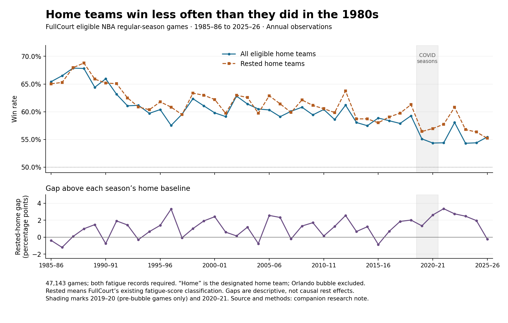

# Is NBA home advantage shrinking?

Research and publishing discussion, 2026-09-11. The initial exploration and subsequent owner
decisions are retained below. Deployment evidence belongs in the release review.

## Fresh measurement

The database read returned 47,143 eligible games across 41 seasons, dated 1985-10-25 through 2026-04-12. The long-term decline is clear descriptively and survives removing the two COVID-affected seasons.

| Pooled period | Games | Home win rate | Rested-home wins / games | Rested-home win rate | Gap above period baseline | Mean home margin |
| --- | ---: | ---: | ---: | ---: | ---: | ---: |
| 1985-86 through 1989-90 | 4,961 | 66.36% | 1,956 / 2,938 | 66.58% | +0.22 pp | +5.23 points |
| 2016-17 through 2025-26 | 11,891 | 56.20% | 3,717 / 6,394 | 58.13% | +1.93 pp | +2.10 points |
| 2021-22 through 2025-26 | 6,150 | 55.32% | 1,873 / 3,261 | 57.44% | +2.12 pp | +1.95 points |

The first-to-last five-season comparison falls 11.04 percentage points for home win rate and 9.14 points for rested-home win rate. These periods were chosen as equal-length endpoint summaries, not as a fitted change-point model.

Across all 41 seasons, the home-rate OLS slope is -2.47 percentage points per decade (year/rate correlation -0.850). Excluding 2019-20 and 2020-21 leaves -2.37 points per decade (-0.837). Home scoring margin also falls, at -0.77 points per decade in the full sample.

The rest-related gap tells a different story. Over the last ten seasons its slope is -0.025 percentage points per decade, with correlation -0.007: almost no linear temporal association in this window. Removing the COVID seasons leaves a similarly small slope of -0.076. This is not a test proving that the rest effect is constant. Across the full history, the gap's descriptive slope is mildly positive (+0.37 points per decade).

Recent home rates also show why “decreasing every season” would be misleading: 54.4%, 58.0%, 54.3%, 54.4%, and 55.4% from 2021-22 through 2025-26.

Reproduce the data with `pnpm exec tsx scripts/research_home_advantage_trend.ts` (configured database required), then the figure with `python3 scripts/plot_home_advantage_trend.py` (Matplotlib required). The [JSON](2026-09-11-home-advantage-trend.json) includes methodology, all annual observations, era summaries, slopes and validation. The [CSV](2026-09-11-home-advantage-trend.csv) contains the annual counts and outcomes.

Validation: the new calculation matches `buildHistoricalBacktest()` totals and all 41 season rows. It also matches the previous local era report's 47,143 games, 27,400 rested-home games and 16,761 rested-home wins. An independent Python calculation checked annual rates from counts and reproduced the full-period slope with NumPy. These establish calculation consistency, not independent verification of every provider game record.

## What to measure

Three quantities answer different questions:

1. **Home win rate:** home wins divided by all eligible games in the season.
2. **Rested-at-home win rate:** home wins divided by games where FullCourt classifies the home team as more rested. This uses the existing fatigue score and neutral cutoff, not simply days off.
3. **Gap above the season baseline:** (2) minus (1), in percentage points. This descriptive comparison does not isolate the causal effect of rest; the rested-home games are a selected subset of the baseline population.

Average home-minus-away final-score margin provides a useful second outcome. It is not adjusted for pace, possessions, team strength, roster availability, or competitive balance.

## Research context

- [Ribeiro et al., PLOS ONE, 2016](https://journals.plos.org/plosone/article?id=10.1371/journal.pone.0152440) studied 16,133 games from 2001-02 through 2013-14. They described home win rate as nearly constant around 60% in that window, while the scoring margin showed a weak downward trend. The study explicitly notes that the margin comparison does not adjust for team ability or competitive balance. This is a reason to show actual season variation and be precise about the outcome and time window.
- [Harris and Roebber, PLOS ONE, 2019](https://journals.plos.org/plosone/article?id=10.1371/journal.pone.0220630) report a gradual NBA decline and associate differences in home advantage with shooting style. Their neural-network analysis links greater two-point and free-throw production to larger home advantages. It suggests an explanation involving the changing shot mix, but does not establish that three-point shooting caused FullCourt's observed trend. The paper excludes lockout seasons and uses a different home-advantage definition, so its estimates should not be copied onto our series.
- [Bayesian analysis of home advantage in North American professional sports before and during COVID-19, Scientific Reports, 2021](https://www.nature.com/articles/s41598-021-93533-w) compares NBA, NHL, MLB, and NFL while modeling team strength. Pandemic changes differed by league; small restricted-game samples and existing trends complicate the NBA interpretation. It supports treating COVID as a distinct context, not using the bubble as an ordinary home-court season or assuming a universal U.S. sports decline.

These papers provide interpretation and alternative explanations. A FullCourt graph should come from FullCourt's reproducible game counts, with its population labeled, rather than combine incompatible published estimates.

## Population and limits

The producer uses `getCompletedGamesWithFatigue()` and the existing `classifyRestAdvantage()` / `isCalledSide()` rules. The query requires final regular-season games, both scores, and both fatigue records. `publishableGames()` excludes the 2019-20 Orlando bubble. The 2020-21 attendance-restricted season remains in the main series; a sensitivity analysis removes both 2019-20 and 2020-21.

This is the **FullCourt eligible-game population**, not an independently reconciled census of all NBA games. The baseline uses the designated home team. Other neutral-site games are not excluded by this query, and the documented neutral-site flag has incomplete historical coverage. Before labeling a future chart as physical home-court advantage, reconcile eligible rows against all completed games and inspect neutral venues.

Annual rates fluctuate. A long-term negative slope does not mean a decline every year, establish a causal mechanism, or predict the next season. Season-level correlations and ordinary least-squares slopes are descriptive; they do not account for time dependence or repeated teams. The current fatigue model applied to historical games is not evidence of historical out-of-sample betting performance.

## Product discussion

### Agreed during the owner discussion

- The central takeaway is: home teams win less often than they used to, so rested-at-home results need their season's home baseline.
- Use **Home win rate** for the percentage and **Home-court advantage** for the broader topic. The rested-home gap is descriptive rather than causal. These terms are recorded in [the glossary](../GLOSSARY.md).
- A dedicated Home-court advantage study page will be reached through Explore. It will contain the historical chart, research context, and an expandable annual data table.
- Season Report will visibly group the selected season's home win rate, rested-at-home win rate, and their gap, with a link to the historical study. It will not initially duplicate the historical chart.
- Show the selected season's home win rate from the first eligible completed game, with wins and game count. Label an ongoing season as season to date. Before results, show Awaiting results. Small samples must not trigger conclusions about a changed trend. Keep the baseline available even when the rested-home comparison has insufficient games.
- The main chart will show two annual lines, Home win rate and Rested-at-home win rate, visible together by default. Connect annual observations with straight segments; initially omit regression and smoothing. Season inspection will expose both rates, their gap, and counts. Do not add a separate gap panel at launch.
- An expandable View season data table will show newest seasons first, with season, home wins / games, home win rate, rested-home wins / games, rested-home win rate, and gap. Season links open the corresponding Season Report. Scoring margin is omitted from the initial presentation.
- Include the unfinished season in the historical chart as a visually distinct season-to-date point. Historical summaries use completed seasons only.
- All new design must follow FullCourt's established design philosophy and UI/UX conventions. Reuse the existing brand grammar, semantic colors, typography, controls, chart/table interactions, responsive behavior, and accessibility conventions rather than introducing a separate visual style.
- The owner approved applying antislop during design and implementation.
- The owner approved retaining the existing 100-eligible-rested-home-game display threshold consistently across Season Report, the study chart, and its table. Before the threshold, show the home win rate and counts, but label the rested-home percentage and gap Too early. The owner accepted the approximately four-week wait after reviewing historical threshold dates.
- A fresh threshold measurement found 25.5 elapsed calendar days on average across 41 seasons (range 21–33), 27.2 days over the last ten (24–31), and 27.6 days over the last five (26–31). The clock starts on the first eligible game date, counted as day zero; the endpoint is the date of the 100th canonically classified rested-home game across the league. These are retrospective dates, not measured data-ingestion availability times. See [annual threshold dates](2026-09-11-rested-home-threshold.json). The threshold is a display policy, not a guarantee of statistical certainty.
- The owner confirmed the publishing plan and requested implementation. Routine details follow the agreed behavior and existing FullCourt conventions. [D-70](../DECISIONS.md) records the decision.

### Pre-publication coverage check

A fresh read-only comparison found 47,143 final scored non-bubble regular-season records
and 47,143 eligible records, with no missing fatigue records in this snapshot. There were
28 flagged neutral-site games. The 2025-26 season had all 1,230 records final; 2026-27 had
1,200 scheduled records and no final results. Missing unassigned NBA Cup fixtures mean
scheduled-row counts alone cannot guarantee season completeness. The historical neutral-site
limitation remains. See the [coverage output](2026-09-11-home-court-coverage.json), produced by
`pnpm exec tsx scripts/audit_home_court_coverage.ts`.

The general home-rate history would add context that the existing Analysis chart intentionally removes: `SeasonWinRateBySeasonChart` already subtracts each season's home baseline to show the rest-related gap. A new raw-rate chart answers a distinct question.

The initial proposal considered Explore and a small Season Report chart. The owner selected
the dedicated study and compact report comparison recorded above; scoring margin remains
research evidence rather than part of the launch presentation.

The exploratory figure above uses a separate gap panel; the owner chose season inspection
and the expanded table for that gap in the product. Preserve annual observations and counts,
explain pandemic coverage, and avoid a title that presupposes an uninterrupted decline.
Cross-sport comparison would require separate, consistently defined league datasets and
remains a later research question.
